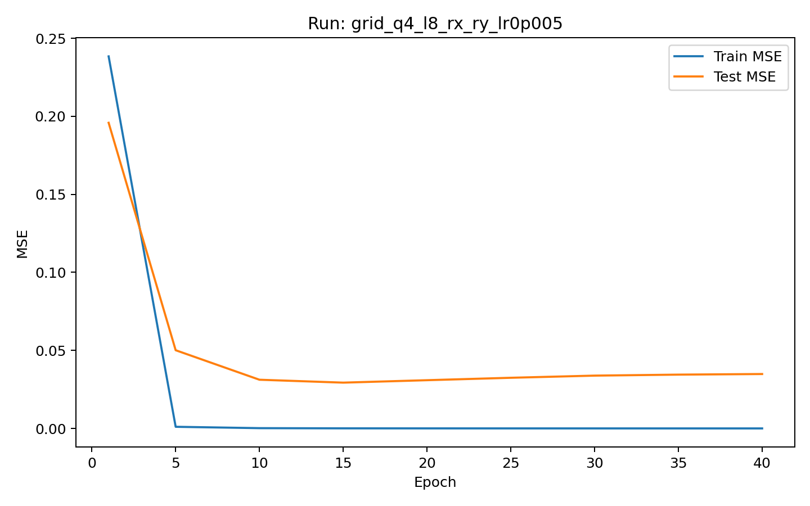
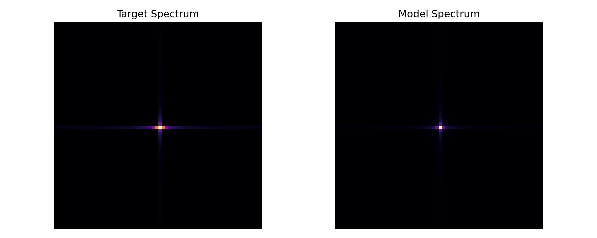
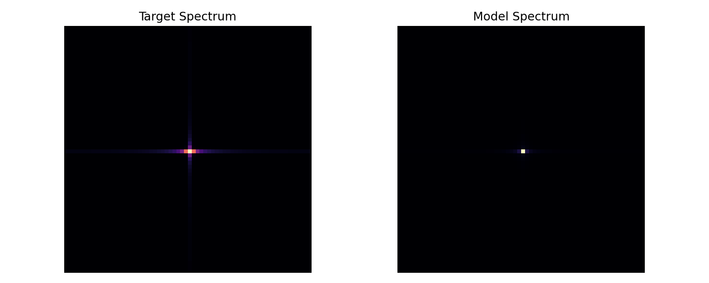

# Problem 1

## Problem Setup

We consider the target function

$$
f(x_1, x_2) = \sin(e^{x_1} + x_2)
$$

The regression task is defined on two different domains:

- Training domain: $x_1, x_2 \in [0, 0.5]$
- Test domain: $x_1, x_2 \in [0.5, 1]$

The random seed is set to the numerical part of the student ID:

- Seed: `12505009`

The evaluation metric is mean squared error (MSE).

To search for a good data reuploading circuit, I performed a full sweep over:

- Number of qubits: `2, 3, 4`
- Number of layers: `2, 4, 6, 8`
- Encoding types: `rx_ry`, `ry_rz`
- Learning rate: `0.005`

All models were trained and tested using the full dataset size:

- `1000` training samples
- `1000` test samples

The best configuration found in the sweep is:

- `4 qubits`
- `8 layers`
- `rx_ry` encoding
- learning rate `0.005`

This model achieved:

- Best test MSE: `0.029371`
- Final test MSE at epoch `40`: `0.034888`

## (a) Training Loss And Test Loss Versus Epoch

The best model is `grid_q4_l8_rx_ry_lr0p005`.

Best-model training curve:

Observation:

- The best model improves quickly during the early stage of training.
- The test MSE drops from `0.195855` at epoch `1` to `0.029371` at epoch `15`.
- After epoch `15`, the test MSE increases slightly, but the degradation is mild. At epoch `40`, the test MSE is still only `0.034888`.
- This suggests that the model is expressive enough to capture the target function while maintaining relatively stable generalization on the unseen test domain.

## (b) Comparison Of Hyperparameter Configurations

The table below compares all tested configurations. It includes the number of qubits, the number of layers, the encoding type, the number of trainable parameters, the best test MSE observed during training, and the final test MSE at the last epoch.

| Model | Qubits | Layers | Encoding | Parameters | Best Epoch | Best Test MSE | Final Test MSE | Train MSE |
| --- | ---: | ---: | --- | ---: | ---: | ---: | ---: | ---: |
| `grid_q4_l8_rx_ry_lr0p005` | 4 | 8 | `rx_ry` | 103 | 15 | 0.029371 | 0.034888 | 0.000090 |
| `grid_q4_l4_rx_ry_lr0p005` | 4 | 4 | `rx_ry` | 55 | 40 | 0.043251 | 0.043251 | 0.000070 |
| `grid_q4_l4_ry_rz_lr0p005` | 4 | 4 | `ry_rz` | 55 | 10 | 0.045497 | 0.065842 | 0.000595 |
| `grid_q4_l2_rx_ry_lr0p005` | 4 | 2 | `rx_ry` | 31 | 1 | 0.053724 | 0.097634 | 0.064411 |
| `grid_q3_l4_rx_ry_lr0p005` | 3 | 4 | `rx_ry` | 42 | 40 | 0.068188 | 0.068188 | 0.000043 |
| `grid_q4_l2_ry_rz_lr0p005` | 4 | 2 | `ry_rz` | 31 | 1 | 0.066373 | 0.120815 | 0.010686 |
| `grid_q2_l8_rx_ry_lr0p005` | 2 | 8 | `rx_ry` | 53 | 40 | 0.070377 | 0.070377 | 0.000088 |
| `grid_q2_l8_ry_rz_lr0p005` | 2 | 8 | `ry_rz` | 53 | 40 | 0.073511 | 0.073511 | 0.000066 |
| `grid_q2_l2_rx_ry_lr0p005` | 2 | 2 | `rx_ry` | 17 | 1 | 0.084751 | 0.496933 | 0.614499 |
| `grid_q4_l8_ry_rz_lr0p005` | 4 | 8 | `ry_rz` | 103 | 35 | 0.087337 | 0.088646 | 0.000051 |
| `grid_q3_l6_ry_rz_lr0p005` | 3 | 6 | `ry_rz` | 60 | 1 | 0.088204 | 0.141820 | 0.057232 |
| `grid_q4_l6_ry_rz_lr0p005` | 4 | 6 | `ry_rz` | 79 | 1 | 0.091493 | 0.337350 | 0.193960 |
| `grid_q2_l2_ry_rz_lr0p005` | 2 | 2 | `ry_rz` | 17 | 1 | 0.095744 | 0.420966 | 0.624392 |
| `grid_q3_l8_ry_rz_lr0p005` | 3 | 8 | `ry_rz` | 78 | 1 | 0.104570 | 0.206023 | 0.403502 |
| `grid_q3_l6_rx_ry_lr0p005` | 3 | 6 | `rx_ry` | 60 | 1 | 0.105683 | 0.247177 | 0.068129 |
| `grid_q3_l8_rx_ry_lr0p005` | 3 | 8 | `rx_ry` | 78 | 1 | 0.121496 | 0.431889 | 0.432931 |
| `grid_q2_l4_ry_rz_lr0p005` | 2 | 4 | `ry_rz` | 29 | 40 | 0.138817 | 0.138817 | 0.000044 |
| `grid_q4_l6_rx_ry_lr0p005` | 4 | 6 | `rx_ry` | 79 | 1 | 0.182120 | 0.465224 | 0.137424 |
| `grid_q3_l2_ry_rz_lr0p005` | 3 | 2 | `ry_rz` | 24 | 40 | 0.245351 | 0.245351 | 0.000069 |
| `grid_q2_l6_ry_rz_lr0p005` | 2 | 6 | `ry_rz` | 41 | 1 | 0.253586 | 0.554670 | 0.012097 |
| `grid_q2_l6_rx_ry_lr0p005` | 2 | 6 | `rx_ry` | 41 | 1 | 0.296365 | 0.757952 | 0.015331 |
| `grid_q2_l4_rx_ry_lr0p005` | 2 | 4 | `rx_ry` | 29 | 40 | 0.317951 | 0.317951 | 0.000040 |
| `grid_q3_l4_ry_rz_lr0p005` | 3 | 4 | `ry_rz` | 42 | 40 | 0.320085 | 0.320085 | 0.000027 |
| `grid_q3_l2_rx_ry_lr0p005` | 3 | 2 | `rx_ry` | 24 | 40 | 0.343280 | 0.343280 | 0.000010 |

Comparison summary:

- The best-performing models are concentrated in the `4-qubit` group.
- The top two models both use `rx_ry` encoding.
- The strongest model is also the deepest successful model: `4 qubits + 8 layers + rx_ry`.
- Some deeper models perform poorly, so more depth does not automatically guarantee better generalization.
- Several weak models obtain their best test MSE at epoch `1`, which indicates severe overfitting or unstable generalization on the extrapolation domain.

## (c) Fourier Spectrum Comparison And Discussion

Best-model Fourier spectrum (8 layers):

Shallow-model Fourier spectrum (2 layers, for comparison):

Discussion:

- The 8-layer model reproduces the dominant spectral structure of the target function much more faithfully than the shallower configuration.
- The 2-layer model (shown for comparison) captures only the lowest frequency components and struggles to approximate the target function accurately on the test domain. Its frequency spectrum is noticeably blurrier and less precise.
- This comparison visibly confirms the Fourier-series interpretation of data reuploading circuits outlined in Ref. [1]: increasing the number of layers (circuit depth) expanding the accessible frequency content, allowing the model to capture more complex, high-frequency variations in the data.
- However, the sweep results show that increasing model expressivity helps only when the encoding choice is appropriate (e.g., `rx_ry` vs `ry_rz`). A deeper circuit alone is not sufficient, since some deep models still overfit or generalize poorly if the encoding does not span the necessary frequencies efficiently.

## Final Remark

The full sweep shows that the best configuration for this task is `4 qubits + 8 layers + rx_ry` with learning rate `0.005`. This model achieves a best test MSE of `0.029371`, which is well below the assignment target of `0.1`.
