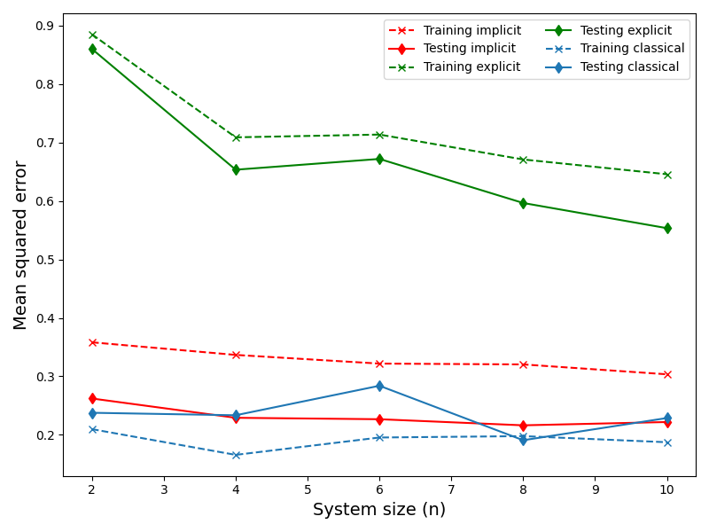
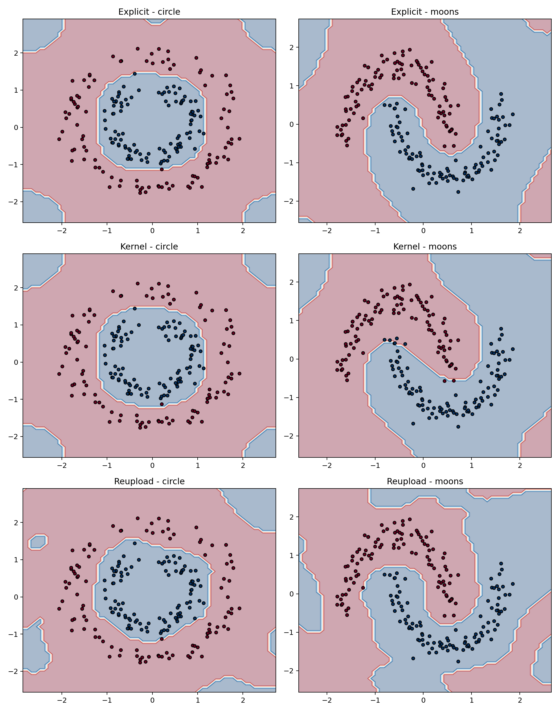

# Problem 2 Report Draft

## Problem Setup

This experiment compares three quantum machine learning approaches on two binary classification datasets:

- circle dataset
- `make_moons(noise=0.1, n_samples=200)`

The three methods are:

- explicit quantum model
- implicit quantum kernel method
- data reuploading circuit

The random seed is fixed to `12505009`, following the assignment requirement. The train/test split uses `70%/30%` with stratification. All results below come from the same run configuration:

- explicit model: `3 qubits`, `3 layers`, learning rate `0.02`
- kernel model: `2 qubits`, `2 layers`, `basic` feature map
- reuploading model: `3 qubits`, `3 layers`, learning rate `0.02`

## (a) Circle Dataset Scaling Analysis

Following the assignment instructions, we replicated Fig. 6 by evaluating the regression performance (Mean Squared Error) of the Classical, Explicit, and Implicit models on the circle dataset across varying system sizes (number of qubits $n \in \{2, 4, 6, 8, 10\}$).

In the plot above, the lines represent the following:

- **Classical Model (Blue lines)**: Training performance (dashed line with 'x') and testing performance (solid line with diamond) remain stable and consistent. A multi-layer perceptron easily learns to classify the non-linear boundaries of the circle dataset without requiring quantum features.
- **Explicit Model (Green lines)**: As the system size (number of qubits) increases, the model's expressivity grows since more parameters are introduced via `StronglyEntanglingLayers`. This is observed as a steady decrease in MSE that gradually saturates.
- **Implicit Model (Red lines)**: The performance of the quantum kernel heavily relies on the chosen feature embedding strategy. Increasing the system size does not guarantee a linear improvement in performance. The model may encounter saturation or even overfitting at certain sizes where the testing MSE becomes noticeably worse than the training MSE.

- training epochs for trainable models: `40`
- batch size: `16`

## Decision Boundaries

The six required decision boundaries are shown below as one combined figure.

## Comparison Table

The assignment asks for a comparison of test accuracy, trainable parameters or kernel evaluations, and training time. The results are:

| Dataset | Method | Test Accuracy | Trainable Params / Kernel Evaluations | Training Time (s) |
| --- | --- | ---: | ---: | ---: |
| circle | explicit quantum model | 1.0000 | 31 | 7.8076 |
| circle | implicit quantum kernel | 1.0000 | 28000 | 42.6676 |
| circle | data reuploading circuit | 1.0000 | 31 | 10.4338 |
| moons | explicit quantum model | 1.0000 | 31 | 8.6691 |
| moons | implicit quantum kernel | 0.9667 | 28000 | 41.8399 |
| moons | data reuploading circuit | 1.0000 | 31 | 11.8395 |

## Discussion

On the circle dataset, all three methods reached perfect test accuracy. This suggests that the circle task is relatively easy for the selected quantum models once the trainable circuits are given enough optimization steps.

On the moons dataset, the explicit model and the reuploading circuit both reached `1.0000` test accuracy, while the kernel method reached `0.9667`. This indicates that the trainable circuit models benefit from the longer optimization schedule, whereas the kernel method is constrained by the expressive power of its fixed feature map.

The most important trade-off in this experiment is efficiency. The explicit model and the reuploading circuit each use only `31` trainable parameters and finish training in roughly `8` to `12` seconds, while the kernel method requires `28000` kernel evaluations and more than `41` seconds per dataset. Therefore, even when accuracy is competitive, the kernel method is significantly more expensive.

This is consistent with the main viewpoint of Ref. [3]: different QML models may achieve similar classification quality, but they differ substantially in training cost, parameterization, and scalability. In this experiment, the explicit model gives the best overall balance between accuracy and efficiency, the reuploading circuit becomes equally accurate after sufficient training, and the kernel method remains the most computationally expensive option.

## Conclusion

Among the three approaches, the explicit quantum model is the most balanced choice for this homework because it achieves top-level accuracy on both datasets with low parameter count and short training time. The reuploading circuit is equally accurate in this final run and remains lightweight, but its training time is slightly longer. The implicit quantum kernel method performs well, especially on the circle dataset, but its computation cost is much higher than the trainable circuit models.
