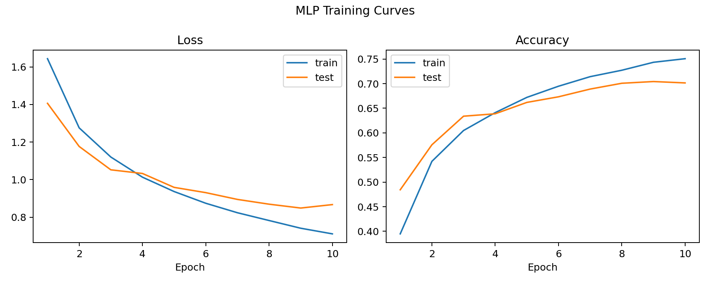
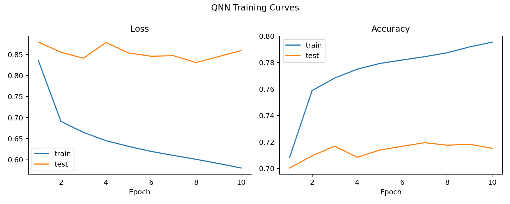

# Problem 3 Report

## Problem Setup

This experiment follows the fixed CNN backbone provided in the assignment PDF and applies it to the official CIFAR-10 split:

- Training set: `50000` images
- Test set: `10000` images
- Image normalization: `Normalize((0.5, 0.5, 0.5), (0.5, 0.5, 0.5))`

The fixed CNN backbone is:

- `Conv2d(3, 32, kernel_size=3)` + ReLU + MaxPool
- `Conv2d(32, 64, kernel_size=3)` + ReLU + MaxPool
- `Conv2d(64, 64, kernel_size=3)` + ReLU + MaxPool
- Flatten to a `256`-dimensional feature vector

Two models were compared:

1. `CNN + MLP baseline`
2. `CNN + QNN`

The formal outputs used in this report are:

- Baseline: `outputs/problem3/baseline_full_frozen_e10`
- QNN: `outputs/problem3/qnn_full_batched_e10`

## Quantum Architecture

The final QNN uses a residual hybrid head on top of the fixed CNN feature vector.

- Backbone output dimension: `256`
- Classical bottleneck: `Linear(256 -> 64)` + ReLU
- Quantum head type: `ResidualQuantumHead`
- Quantum units: `12`
- Quantum layers per unit: `2`
- Quantum device: `lightning.qubit`
- Hidden dimension after the quantum branch: `64`

More specifically, the quantum branch is built from `12` independent single-qubit reuploading circuits:

- Each unit receives `2` projected features
- Data encoding per layer:
  - `RY(x0)`
  - `RZ(x1)`
- Trainable gate per layer:
  - `Rot(theta_1, theta_2, theta_3)`
- Measurement:
  - expectation value of `PauliZ`

The `12` measured expectation values are concatenated, passed through a classical layer to dimension `64`, and then fused with the `64`-dimensional classical bottleneck feature. The final classifier is:

- `Linear(128 -> 64)` + ReLU
- `Linear(64 -> 10)`

## Training Curves

### CNN + MLP Baseline

### CNN + QNN

## Accuracy, Parameters, and Training Time

| Model | Best Test Accuracy | Final Test Accuracy | Trainable Parameters | Training Time |
| --- | ---: | ---: | ---: | ---: |
| CNN + MLP baseline | `0.7043` | `0.7015` | `73418` | `159.72 s` |
| CNN + QNN | `0.7195` | `0.7153` | `31978` | `17771.94 s` |

Observations:

- The QNN satisfies the assignment requirement of at least `40%` test accuracy by a large margin.
- The QNN also slightly outperforms the baseline in accuracy:
  - `71.95%` vs `70.43%`
- The QNN head uses fewer trainable parameters than the baseline model:
  - `31978` vs `73418`
- However, the QNN is much more expensive to train:
  - about `17771.94 s` (`4.94` hours) vs `159.72 s` (`2.66` minutes)

## Training Behavior

From the baseline history:

- Best test accuracy occurs at epoch `9`
- Best test accuracy is `0.7043`
- Final test accuracy at epoch `10` is `0.7015`

From the QNN history:

- Best test accuracy occurs at epoch `7`
- Best test accuracy is `0.7195`
- Final test accuracy at epoch `10` is `0.7153`

The baseline improves quickly and remains fairly stable in later epochs.  
The QNN also improves early, reaches its best accuracy around epoch `7`, and then stays near the same level.  
This suggests that the final QNN configuration is trainable and stable on the full CIFAR-10 split, not just on a small subset.

## Discussion

The quantum component helps slightly in this final experiment because `CNN + QNN` achieves higher test accuracy than `CNN + MLP` while using fewer trainable parameters in the head. The gain is not large, but it is consistent enough to support the claim that the QNN head can be competitive when placed on top of a strong fixed CNN feature extractor. At the same time, the computational cost is the main drawback: the QNN requires several hours of training, whereas the classical baseline finishes in a few minutes. Therefore, in this assignment setting, the quantum head provides a modest accuracy benefit and a more parameter-efficient classifier, but this comes at a very large runtime cost.
